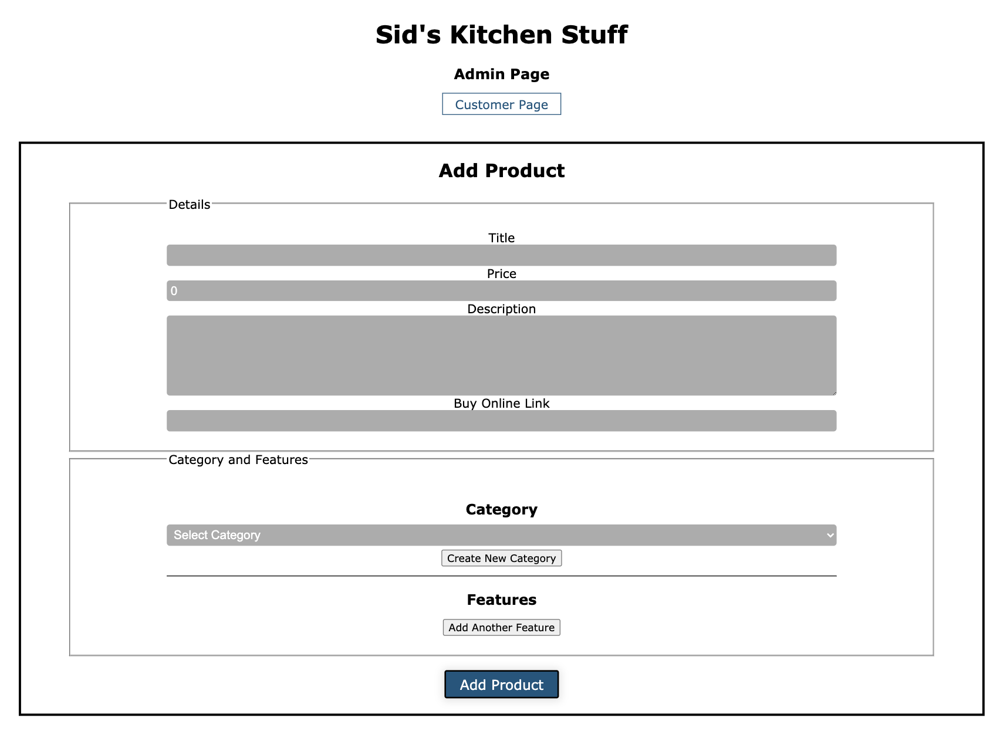
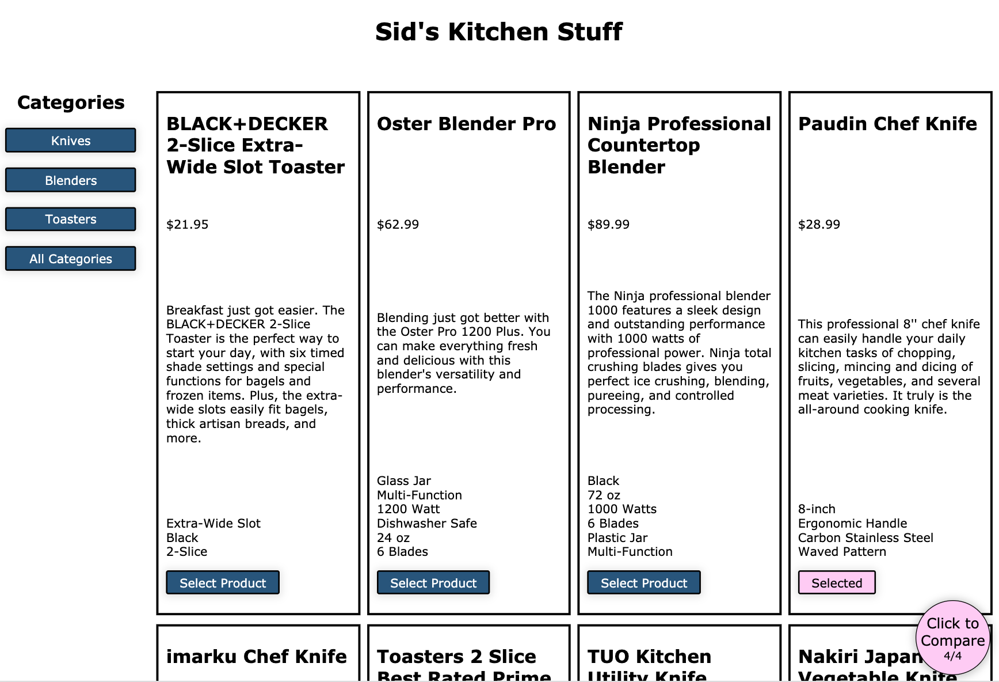
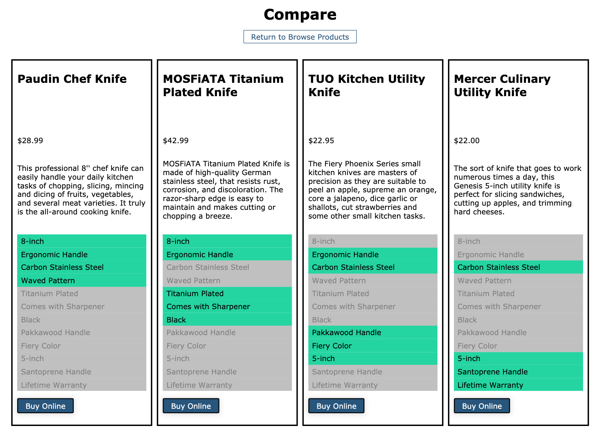

# Feather Report Server

### Summary
[Live Demo](https://featherreport.biz/)

API server for [Feather Report Client](https://github.com/Tarv44/feather-report-client).

This is my second fullstack project that I've built. It provides a straightforward platform for small businesses to upload products and give their customers a useful compare tool.

### Enpoints:

* POST /companies - creates new company
* POST /companies/login - verifies login data and returns company data
* GET /companies/:pathname/products - returns all product data for company with given pathname

* POST /products - creates new product
* PATCH /products - updates product

* POST /categories - creates new category
* GET /categories/:cat_id/features - returns all features for a given category

* POST /features - creates new feature

### Technology used:
* PostgreSQL
* Express
* Node

***

